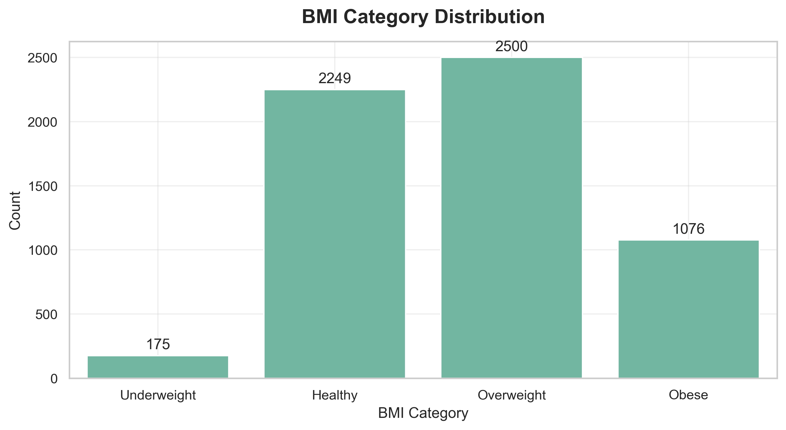
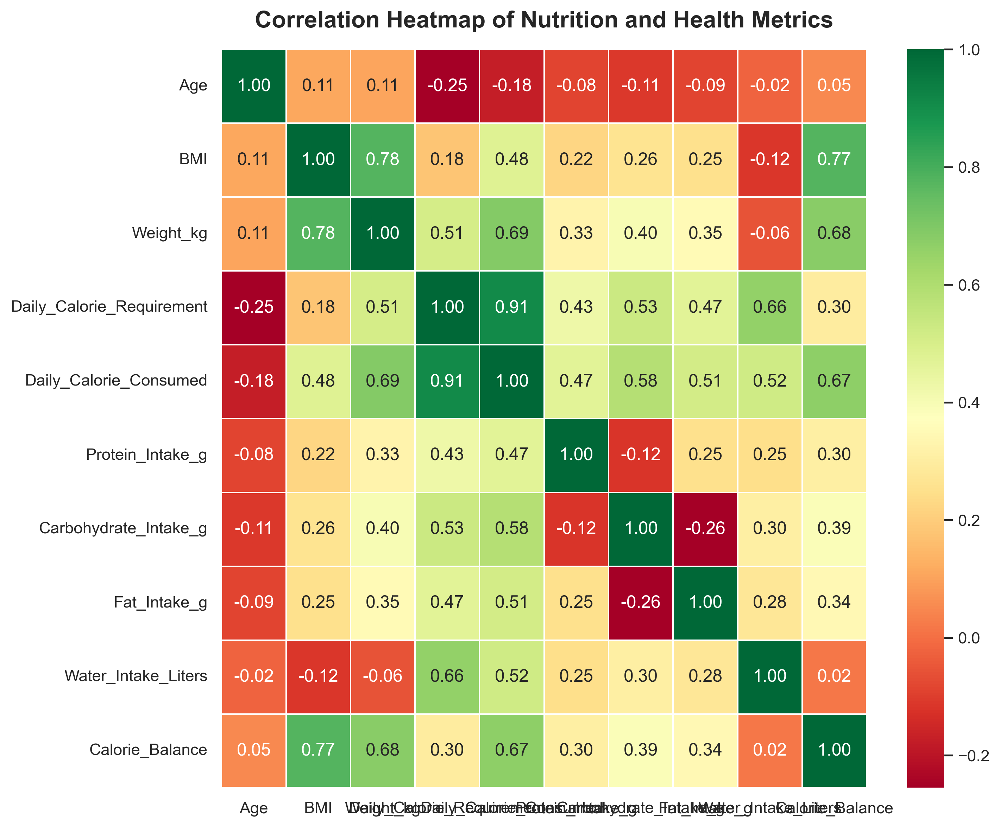
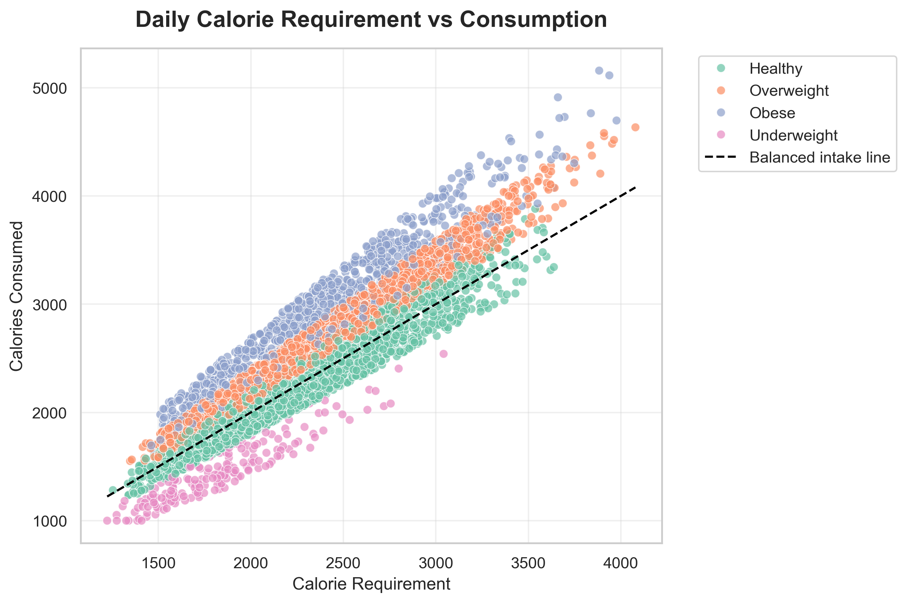
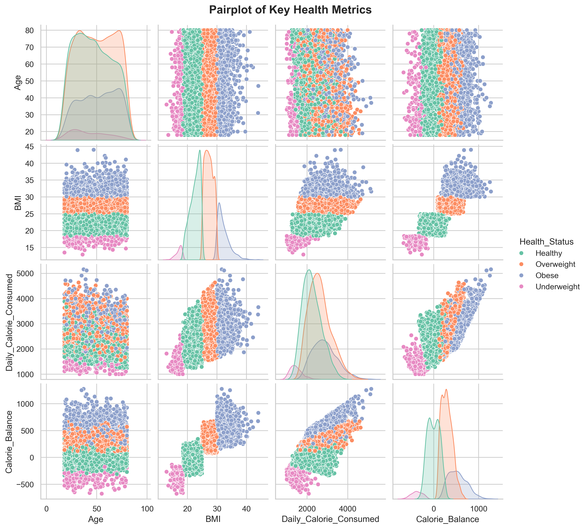

# Healthy Diet and Calorie Intake Analysis

## Project Overview

This project presents an Exploratory Data Analysis (EDA) of a Healthy
Diet and Calorie Intake dataset using Python. The goal is to understand
the relationships between nutrition, physical activity, BMI, calorie
intake, and overall health status through data visualization and
statistical analysis.

##  Project Visualizations

<h3>BMI Category Distribution</h3>

---

### Correlation Heatmap

---

### Daily Calorie Requirement vs Consumption

---

### Pairplot of Key Health Metrics

## Problem Statement

Maintaining a healthy lifestyle requires balancing nutrition, physical
activity, and calorie intake. This project analyzes health and nutrition
data to uncover patterns in dietary habits, BMI, calorie balance, and
lifestyle factors that influence overall health.

## Objectives

-   Analyze participant demographics.
-   Explore BMI and health status distribution.
-   Study calorie and nutrient intake patterns.
-   Understand the relationship between physical activity and nutrition.
-   Identify correlations among health metrics.
-   Generate actionable insights from the data.

## Dataset

The dataset includes Age, Gender, Height, Weight, BMI, Daily Calorie
Requirement, Daily Calorie Consumed, Protein, Carbohydrates, Fat, Water
Intake, Activity Level and Health Status.

## Tools & Technologies

-   Python
-   Pandas
-   NumPy
-   Matplotlib
-   Seaborn
-   Jupyter Notebook

## Key Insights

-   The dataset is clean and contains no missing values.
-   Most participants belong to the Healthy and Overweight BMI
    categories.
-   Daily calorie consumption is strongly correlated with daily calorie
    requirements.
-   BMI shows a strong relationship with weight and calorie balance.
-   Higher activity levels generally correspond to higher calorie,
    protein, and water intake.
-   Age has relatively weak correlations with the other health metrics.

## Conclusion

The analysis demonstrates how dietary habits, physical activity, calorie
balance, and BMI are interconnected. These insights can support
nutrition planning, health monitoring, and future predictive analytics.

## Future Scope

-   Build machine learning models to predict BMI or Health Status.
-   Create an interactive Tableau or Power BI dashboard.
-   Develop personalized nutrition recommendations.

## Repository Structure

Healthy-Diet-Analysis/ - Healthy_Diet_Final.ipynb -
healthy_diet_calorie_intake.csv - README.md - requirements.txt - images/

## Author

**Divya Dande** Aspiring Data Analyst
